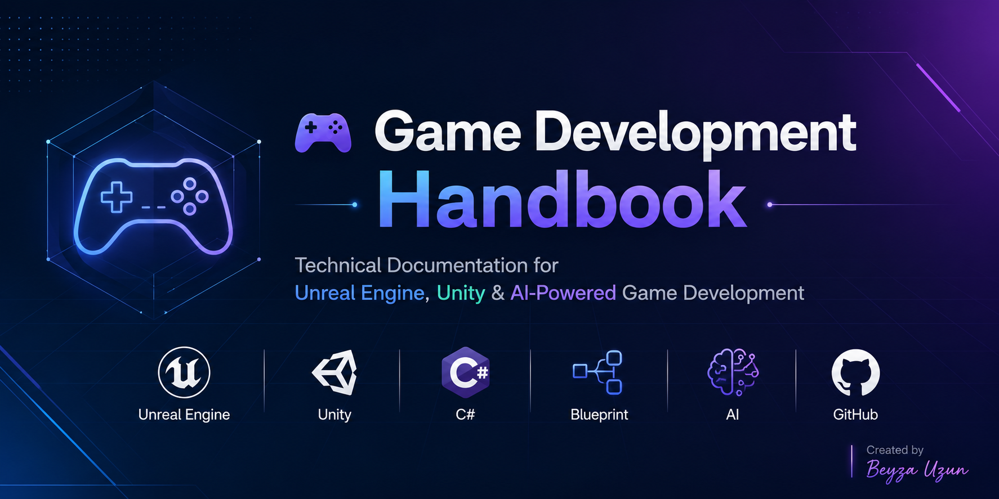

<p align="center">
  
</p>

<h1 align="center">🎮 Game Development Handbook</h1>

<p align="center">
<strong>Technical Documentation for Unreal Engine, Unity & AI-Powered Game Development</strong>
</p>

<p align="center">
From learning notes to professional technical documentation.
</p>

<p align="center">

<a href="#-about">About</a> •
<a href="#-repository-structure">Repository Structure</a> •
<a href="#-learning-roadmap">Learning Roadmap</a> •
<a href="#-documentation-index">Documentation</a> •
<a href="#-technologies">Technologies</a> •
<a href="#-project-goals">Goals</a>

</p>

---

> ## ✨ Highlights
>
> - 📚 24 Technical Documents
> - 🎮 Unreal Engine Documentation
> - 🧩 Unity Documentation
> - 🤖 AI Tools for Game Development
> - 💼 Interview Tips
> - 🛠️ Hands-on Mini Projects
> - 📖 Best Practices & Learning Roadmaps
> - 🚀 Continuously Updated

## 📖 About

This repository is a comprehensive collection of technical documentation created throughout my game development learning journey.

It covers Unreal Engine, Unity, C# scripting, Blueprints, and AI-powered development workflows through structured notes, practical examples, interview tips, and mini projects.

The goal of this project is not only to document what I learn, but also to create a high-quality knowledge base that can help other developers explore modern game development technologies.

---

## 📊 Project Statistics

| Category | Documents |
|----------|----------:|
| 🎮 Unreal Engine | 8 |
| 🧩 Unity | 9 |
| 🤖 AI Tools | 7 |
| **📚 Total** | **24** |


## 📂 Repository Structure

```text
game-development-study-notes
│
├── 📁 assets
│   └── banner.png
│
├── 📁 docs
│   ├── 📁 unreal-engine
│   │   ├── 01-editor.md
│   │   ├── ...
│   │   └── 08-best-practices.md
│   │
│   ├── 📁 unity
│   │   ├── 01-editor.md
│   │   ├── ...
│   │   └── 09-best-practices.md
│   │
│   └── 📁 ai-tools
│       ├── 01-introduction.md
│       ├── ...
│       └── 07-best-practices.md
│
├── README.md
└── LICENSE
```

### Folder Description

| Folder | Description |
|---------|-------------|
| 📁 assets | Images, banners, and visual resources used in the repository |
| 📁 docs/unreal-engine | Unreal Engine learning notes and technical documentation |
| 📁 docs/unity | Unity documentation, C# scripting, and engine fundamentals |
| 📁 docs/ai-tools | AI-powered tools and workflows for modern game development |
| README.md | Repository overview and navigation |
| LICENSE | Open-source license for the project |


## 🗺️ Learning Roadmap

### 🎮 Unreal Engine
- [x] Editor Basics
- [x] Blueprints
- [x] Animation
- [x] Materials
- [x] Sequencer
- [x] Best Practices

### 🧩 Unity
- [x] Editor
- [x] C# Scripting
- [x] Components
- [x] Physics
- [x] UI
- [x] Animation
- [x] Audio
- [x] Particle System
- [x] Best Practices

### 🤖 AI Tools
- [x] Introduction
- [x] Midjourney
- [x] MetaHuman
- [x] Texture Generation
- [x] AI Audio
- [x] Motion Matching
- [x] Best Practices


## 📚 Documentation Index

### 🎮 Unreal Engine

| Topic | Description |
|-------|-------------|
| Editor Basics | Introduction to the Unreal Engine interface and workflow |
| Blueprints | Visual scripting fundamentals |
| Materials | Material creation and shader basics |
| Animation | Character animation workflow |
| Sequencer | Cinematic creation and timeline editing |
| UI (UMG) | User interface development |
| Optimization | Performance improvement techniques |
| Best Practices | Professional Unreal Engine workflows |

---

### 🧩 Unity

| Topic | Description |
|-------|-------------|
| Unity Editor | Interface and project management |
| C# Scripting | Core scripting concepts |
| Components | Understanding Unity Components |
| Physics | Rigidbody, Collider, and physics simulation |
| UI System | Canvas, TextMeshPro, Buttons, Layouts |
| Animation | Animator, State Machines, Blend Trees |
| Audio | Audio Source, Audio Listener, Audio Mixer |
| Particle System | Creating visual effects |
| Best Practices | Project organization and optimization |

---

### 🤖 AI Tools

| Topic | Description |
|-------|-------------|
| Introduction | AI-assisted game development overview |
| Midjourney | Concept art and prompt engineering |
| MetaHuman | Realistic digital character creation |
| Texture Generation | AI-assisted material workflows |
| AI Audio | Music, voices, and sound effects |
| Motion Matching | Modern animation systems |
| Best Practices | Responsible and efficient AI usage |

## 🛠️ Technologies

### Game Engines

- Unreal Engine 5
- Unity 6

### Programming

- C#
- Blueprint Visual Scripting

### Artificial Intelligence

- Midjourney
- MetaHuman
- AI Audio Tools
- Motion Matching

### Documentation

- Markdown
- GitHub
- GitHub Pages
- 

## 🎯 Project Goals

This project aims to:

- Build structured learning documentation.
- Practice technical writing.
- Create a public knowledge base for game development.
- Document Unreal Engine, Unity, and AI workflows.
- Share practical examples and best practices.

## 🤝 Contributing

Suggestions and improvements are always welcome.

If you notice an error or have an idea for improving the documentation, feel free to open an Issue or submit a Pull Request.

## 📄 License

This project is licensed under the MIT License.

---

## 📬 Connect With Me

- 💼 LinkedIn: https://www.linkedin.com/in/beyza-uzun-1520672b5/
- 💻 GitHub: https://github.com/beyzauzun-ai
- 📧 Email: byzuzn09@gmail.com
---

<p align="center">
Created with ❤️ by <strong>Beyza Uzun</strong>

⭐ If you found this project useful, consider giving it a star.
</p>
